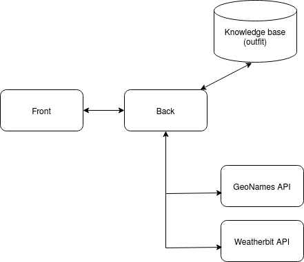

# Умный сервис прогноза погоды

Уровень сложности --- со звездочкой.

### Проектирование сервиса

- Какой язык программирования и технологии использовать для реализации данного сервиса?

        На бэкенде были использованы **Python + Flask**, на фронтенде **Typescript + Angular**.

- Какой будет пользовательский интерфейс?

        Сервис имеет веб-интерфейс.

- Опишите формат ответа, который вернется пользователю со стороны сервера и процесс его генерации.

        Формат ответа --- текстовое сообщение, содержащее информацию о температуре воздуха, давлении, влажности воздуха, облачности, скорости ветра, рекомендации по одежде.
        Процесс генерации ответа описан в разделе Процесс работы программы.

### Работа сервиса



[Видео с работой сервиса]()


### Процесс работы программы

Сервис --- веб-приложение, в котором пользователь вводит данные о своем местоположении и получает информацию о погоде в этом месте.

1) Пользователь вводит город, регион и страну.
2) Из введенных данных формируется поисковый запрос и отправляется на бэк.
3) С помощью API сервиса GeoNames узнаем координаты местоположения.
4) С помощью API сервиса weatherbit.io узнаем текущую погоду в этом месте.
5) Рекомендательная система представляет собой функцию отображения от 4 переменных в комплект одежды. В качестве переменных были выбраны температура воздуха, скорость ветра, облачность и относительная влажность. Все переменные отображаются в отрезок [0, 100] при помощи кусочно-постоянных функций. Значение, соответсвующее комплекту одежды, представляет собой сумму переменных, взятых с некоторыми коэффициентами. Я посчитала, что температура воздуха и относительная влажность воздуха в большей степени влияют на выбираемую одежду, чем облачность и скорость ветра, соответсвенно коэффициенты при этих слагаемых больше.
6) Посчитав оценку погоды, бэкенд обращается к базе знаний по одежде, предварительно загруженной из файловой системы. Было решено хранить базу в жсонах, а не в реляционной базе для упрощения разработки. База знаний представляет собой 2 файла, они находятся в директории [data](data). Первый -- id комплекта и комплект одежды, второй -- айди комплекта и интервал оценки погоды, соответсвующий комплекту.
7) Отправляем данные на фронт.
8) На фронте формируем ответ пользователю и отдаем его.

### Запуск

##### Пререквезиты:

На машине, на которой будет запущен проект, должны быть установлены

- docker (>=19.03.5-beta1)
- docker-compose (>=1.23.0)

Зарегистрироваться на [geonames](http://www.geonames.org/). В [личном кабинете](https://www.geonames.org/manageaccount) включить Free Web Services, записать логин в файл back/.env в переменную GEO_NAMES_USERNAME.

Зарегистрироваться на [weatherbit](https://www.weatherbit.io). В [личном кабинете](https://www.weatherbit.io/account/dashboard) найти Master API Key, записать его в файл back/.env в переменную WEATHERBIT_API_TOKEN.

В итоге в файле back/.env должно быть 2 записи вида:
```
WEATHERBIT_API_TOKEN=XXX
GEO_NAMES_USERNAME=XXX
```

##### Запуск
```bash
./run_app
```

После запуска перейти в браузере по адресу **localhost:4200**
