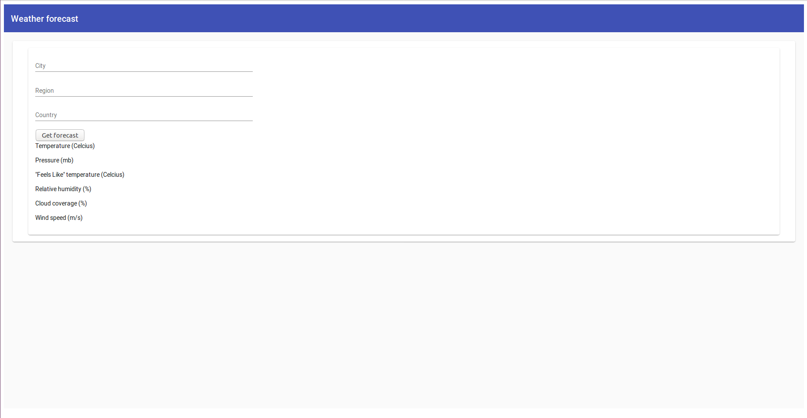
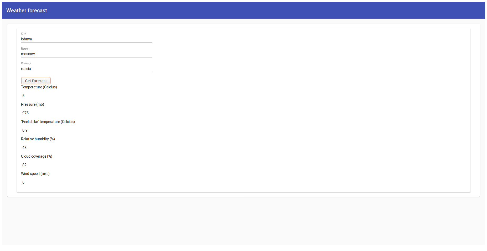
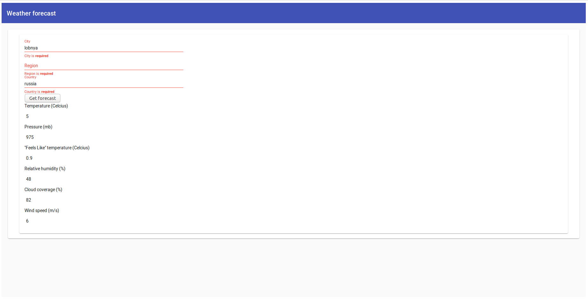
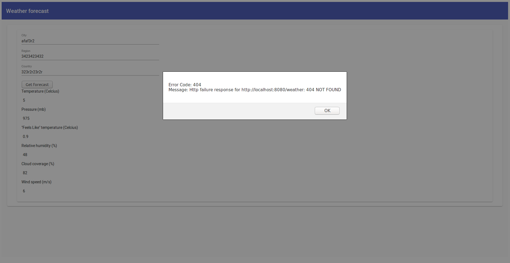

# Умный сервис прогноза погоды

Уровень сложности --- со звездочкой.

### Проектирование сервиса

- Какой язык программирования и технологии использовать для реализации данного сервиса?
  На бэкенде были использованы **Python + Flask**, на фронтенде **Typescript + Angular**.

- Какой будет пользовательский интерфейс?
  Сервис имеет веб-интерфейс.

- Опишите формат ответа, который вернется пользователю со стороны сервера и процесс его генерации.
  Формат ответа --- текстовое сообщение, содержащее информацию о температуре воздуха, давлении, влажности воздуха, облачности, скорости ветра.
  Процесс генерации ответа описан в разделе Процесс работы программы.

### Работа сервиса

При загрузке пользователь видит следующую страницу:



После получения информации о температуре:



Стоит заметить, что время отклика получилось слишком большим для подобной задачи.

Если какое-то из полей незаполненно:



Обработка ошибки выглядит ужасно, но она есть:




### Процесс работы программы

Сервис --- веб-приложение, в котором пользователь вводит данные о своем местоположении и получает информацию о погоде в этом месте.

1) Пользователь вводит город, регион и страну.
2) Из введенных данных формируется поисковый запрос и отправляется на бэк.
3) С помощью API сервиса GeoNames узнаем координаты местоположения.
4) С помощью API сервиса weatherbit.io узнаем текущую погоду в этом месте.
5) Отправляем данные на фронт.
6) На фронте формируем ответ пользователю и отдаем его.

### Запуск

##### Пререквезиты:

На машине, на которой будет запущен проект, должны быть установлены

- docker (>=19.03.5-beta1)
- docker-compose (>=1.23.0)
- node.js (>=13.10.1)
- npm (>=6.13.7)
- angular (>=9.0.6)

Зарегистрироваться на [geonames](http://www.geonames.org/). В [личном кабинете](https://www.geonames.org/manageaccount) включить Free Web Services, записать логин в файл back/.env в переменную GEO_NAMES_USERNAME.

Зарегистрироваться на [weatherbit](https://www.weatherbit.io). В [личном кабинете](https://www.weatherbit.io/account/dashboard) найти Master API Key, записать его в файл back/.env в переменную WEATHERBIT_API_TOKEN.

В итоге в файле back/.env должно быть 2 записи вида:
```
WEATHERBIT_API_TOKEN=XXX
GEO_NAMES_USERNAME=XXX
```

##### Запуск фронтенда
```bash
cd front && ng serve
```

##### Запуск бэкенда
```bash
cd back && ./run_app.sh
```